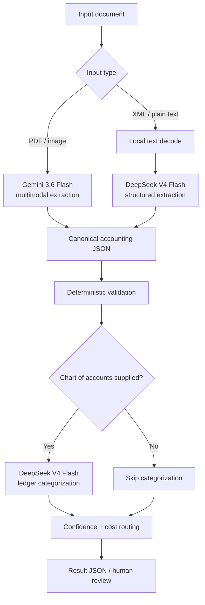

# receipt-to-ledger

A cost-aware accounting document workflow:

**invoice / receipt / credit note / expense note → canonical JSON → validation → ledger category**

The project is deliberately a runnable CLI prototype before it becomes a service. The current goal is to measure extraction quality, category accuracy, latency, and real API cost on representative documents before adding production infrastructure.

## Architecture

PDFs and images go directly to a multimodal model so layout, tables, rotation, handwriting, VAT blocks, and the visual relationship between labels and amounts remain available during extraction.



There is one visual-document path: **original PDF/image → Gemini**. XML and plain text skip vision and use the cheaper structured-text path.

## What works

- PDF invoices and scanned PDFs → Gemini native PDF understanding
- photographed receipts → Gemini image understanding
- structured JSON output into the canonical Pydantic schema
- XML / UBL / plain text → local decode + DeepSeek extraction
- DeepSeek ledger-account categorization against a supplied chart
- deterministic financial validation
- prompt/output/thinking token accounting and estimated API cost
- `$0.15` per-request cost guardrail
- public and private ground-truth evaluation via `rtl eval`

## Quick start

Requirements:

- Python 3.12+
- Gemini API key for PDFs/images
- DeepSeek API key for categorization and text/XML extraction

```bash
git clone https://github.com/selectqoma/receipt-to-ledger.git
cd receipt-to-ledger

python -m venv .venv
source .venv/bin/activate
pip install -e ".[dev]"
```

Configure providers:

```bash
export GEMINI_API_KEY="your-google-key"
export DEEPSEEK_API_KEY="your-deepseek-key"
```

Defaults:

```bash
export GEMINI_MODEL="gemini-3.6-flash"
export GEMINI_THINKING_LEVEL="low"
export GEMINI_MEDIA_RESOLUTION="auto"  # medium PDFs, high images
export DEEPSEEK_MODEL="deepseek-v4-flash"
```

Process and categorize an invoice:

```bash
rtl process path/to/invoice.pdf \
  --chart examples/chart_of_accounts.json \
  --output result.json
```

Process a photographed receipt:

```bash
rtl process path/to/receipt.jpg \
  --chart examples/chart_of_accounts.json \
  --output receipt.json
```

Extraction/validation only:

```bash
rtl process path/to/invoice.pdf
```

Plain text and XML automatically take the DeepSeek text route:

```bash
rtl process examples/sample_expense_note.txt \
  --chart examples/chart_of_accounts.json
```

## Evaluation loop

The benchmark loop is ready now.

Install evaluation dependencies:

```bash
pip install -e ".[dev,eval]"
```

### Public receipt benchmark

CORD v2 gives us receipt images plus ground truth for totals, tax, and line items.

Start small:

```bash
export GEMINI_API_KEY="your-google-key"

rtl eval cord \
  --split validation \
  --limit 25 \
  --max-cost-usd 0.50 \
  --output evaluation-cord.json
```

Then run the complete 100-document validation split:

```bash
rtl eval cord \
  --split validation \
  --limit 100 \
  --max-cost-usd 2.00 \
  --output evaluation-cord-full.json
```

### Private invoice benchmark

For product-specific evaluation, create a local JSONL manifest containing each document and the canonical fields you know are correct.

Example:

```json
{"id":"invoice-001","file":"invoice-001.pdf","ground_truth":{"document_type":"invoice","supplier":{"name":"Example BV","vat_number":"BE0123456789"},"document_number":"INV-001","issue_date":"2026-08-01","currency":"EUR","amounts":{"subtotal":100.0,"tax":21.0,"total":121.0},"category_prediction":{"account_code":"611100"}}}
```

Run extraction + category evaluation:

```bash
export GEMINI_API_KEY="your-google-key"
export DEEPSEEK_API_KEY="your-deepseek-key"

rtl eval manifest test-docs/manifest.jsonl \
  --chart examples/chart_of_accounts.json \
  --limit 25 \
  --max-cost-usd 0.50 \
  --output evaluation-private.json
```

The report tracks:

- field-level exact/normalized accuracy
- cent-exact subtotal, VAT, and total accuracy
- line description / line-total / row accuracy
- whole-document exactness
- ledger-category accuracy when labeled
- API errors
- mean / p50 / p95 latency
- mean / p50 / p95 API cost

Only ground-truth fields present in the manifest are scored, so the first private gold set can start with the important fields and grow over time. See `docs/evaluation.md` for details.

## Estimated cost per document

These are engineering estimates, not billing guarantees. Actual cost depends on page count and output/thinking tokens.

| Document | Route | Expected API cost |
|---|---|---:|
| 1-page PDF invoice | Gemini 3.6 Flash → DeepSeek category | **~$0.005–$0.012** |
| photographed receipt | Gemini 3.6 Flash → DeepSeek category | **~$0.005–$0.012** |
| 2–3 page detailed invoice | Gemini 3.6 Flash → DeepSeek category | **~$0.01–$0.03** |
| 1-page document with Flash-Lite | Gemini 3.5 Flash-Lite → DeepSeek category | **~$0.002–$0.006** |
| XML/plain-text document | DeepSeek extraction → DeepSeek category | **usually < $0.001** |

Product targets:

| Metric | Target |
|---|---:|
| p50 processing cost | < $0.01 |
| average processing cost | < $0.03 |
| p95 processing cost | < $0.08 |
| hard per-request guardrail | $0.15 |

The CLI records provider/model, prompt/input tokens, visible output tokens, thinking tokens when reported, and `estimated_cost_usd`. Once we have a representative corpus, measured p50/p95 values should replace these estimates.

## Review logic

A result requires review by default when:

- deterministic validation fails
- no category is produced
- category confidence is below `0.95`
- estimated request cost exceeds `$0.15`

```bash
rtl process invoice.pdf \
  --chart examples/chart_of_accounts.json \
  --auto-book-threshold 0.90 \
  --budget-usd 0.15
```

Category confidence is currently model-reported, not statistically calibrated. Production thresholds should come from labeled accountant corrections.

## Supported inputs

| Input | Default route |
|---|---|
| PDF with embedded text | Gemini native PDF understanding |
| scanned/mixed PDF | Gemini native PDF vision |
| PNG/JPEG/WebP/etc. | Gemini image vision |
| XML / UBL | local text decode → DeepSeek |
| plain text | local text decode → DeepSeek |
| Factur-X/ZUGFeRD embedded XML | deterministic extraction not implemented yet |

The next structured-document improvement is deterministic UBL / Factur-X mapping so those documents can skip extraction-model calls entirely.

## Safety around test data

Do not commit customer documents or private manifests. The repo ignores `test-docs/`, `data/`, `results/`, and `evaluation*.json` by default.
